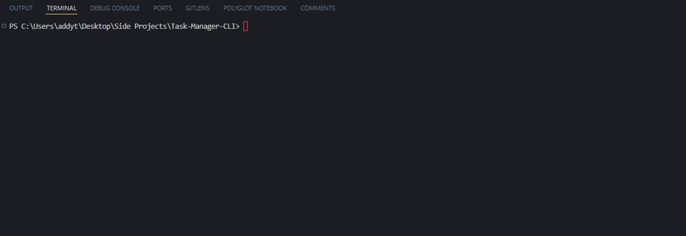

# To-Do CLI Tool with Node.js and MongoDB

Welcome to the To-Do CLI Tool repository! This project is a command-line interface (CLI) tool built using Node.js, designed to manage your to-do tasks efficiently. It utilizes MongoDB as the database to store all your to-dos securely. Additionally, we make use of several helpful npm packages to enhance the functionality and user experience of the tool.

## Dependencies

We leverage the following npm packages to power various aspects of the To-Do CLI Tool:

-   **commander:**  
    This package helps us build the CLI tool by providing a framework for defining commands and options.
    
-   **chalk:**  
    Chalk makes messages in the terminal colorful and easy to read, enhancing the overall user experience.
    
-   **inquirer:**  
    Inquirer simplifies user input by providing a powerful interface for prompting users and handling their responses.
    
-   **ora:**  
    Ora adds a touch of elegance to the terminal interface by displaying nice spinning animations, providing visual feedback to users during long-running tasks.

## Example of this tool in action!

